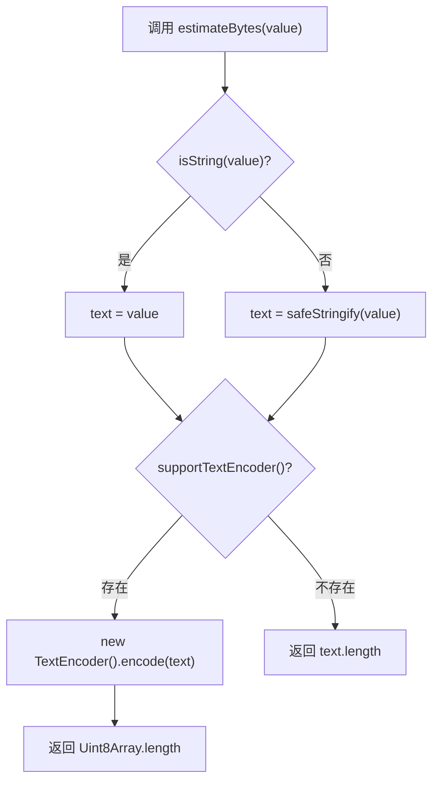

import textDemo from './textDemo?raw'
import objectDemo from './objectDemo?raw'
import { CodeOrSourceMdx } from '@storybook/addon-docs/blocks'

# estimateBytes

估算未知值序列化后的 UTF-8 字节数，适合用于 payload 大小限制、缓存队列体积统计、keepalive/beacon 请求体积判断等场景。

## 开发者视角

`estimateBytes` 的目标是把任意输入压成一个可比较的体积数字。它通常不用于 UI 展示，而是用于工程约束：队列是否超出上限、请求体是否适合走 `sendBeacon`、缓存是否需要淘汰旧数据。

它的输入是 `unknown`，输出是 `number`。核心链路分两段：

1. 把输入稳定地转成字符串。
2. 计算这个字符串在 UTF-8 编码下的字节数。

它和 `formatBytes` 的职责完全不同：

<table>
  <thead>
    <tr>
      <th>工具</th>
      <th>输入</th>
      <th>输出</th>
      <th>核心用途</th>
    </tr>
  </thead>
  <tbody>
    <tr>
      <td>
        <code>estimateBytes</code>
      </td>
      <td>
        <code>unknown</code>
      </td>
      <td>
        <code>number</code>
      </td>
      <td>把未知值估算成字节数，用于限制和判断。</td>
    </tr>
    <tr>
      <td>
        <code>formatBytes</code>
      </td>
      <td>
        <code>number</code>
      </td>
      <td>
        <code>&#123; value, unit, formatted &#125;</code>
      </td>
      <td>把已有字节数格式化为 KB、MB 等展示文本。</td>
    </tr>
  </tbody>
</table>

## 模块边界

<table>
  <thead>
    <tr>
      <th>模块</th>
      <th>职责</th>
      <th>为什么这样拆</th>
    </tr>
  </thead>
  <tbody>
    <tr>
      <td>
        <code>estimateBytes</code>
      </td>
      <td>负责体积估算，不关心业务语义。</td>
      <td>队列、上报、日志模块都能复用同一套体积判断逻辑。</td>
    </tr>
    <tr>
      <td>
        <code>isString</code>
      </td>
      <td>负责判断输入是否已经是字符串。</td>
      <td>
        来自 <code>@justichentai/js-utils/isString</code>，避免在工具里重复写
        <code>typeof value === 'string'</code>。
      </td>
    </tr>
    <tr>
      <td>
        <code>safeStringify</code>
      </td>
      <td>负责非字符串输入的安全序列化。</td>
      <td>
        <code>estimateBytes</code> 不重复实现循环引用和 BigInt 处理。
      </td>
    </tr>
    <tr>
      <td>
        <code>earlyErrorQueue</code>
      </td>
      <td>负责决定队列何时淘汰、payload 何时发送。</td>
      <td>
        它只消费 <code>estimateBytes</code> 返回的数字，不关心字节怎么算。
      </td>
    </tr>
    <tr>
      <td>
        <code>supportTextEncoder</code>
      </td>
      <td>
        负责判断当前环境是否支持全局 <code>TextEncoder</code>。
      </td>
      <td>把能力探测从估算逻辑中抽出，后续其他编码场景可以复用同一判断。</td>
    </tr>
  </tbody>
</table>

## 数据结构

<table>
  <thead>
    <tr>
      <th>数据</th>
      <th>类型</th>
      <th>来源</th>
      <th>用途</th>
    </tr>
  </thead>
  <tbody>
    <tr>
      <td>
        <code>value</code>
      </td>
      <td>
        <code>unknown</code>
      </td>
      <td>调用方传入</td>
      <td>待估算体积的原始值。</td>
    </tr>
    <tr>
      <td>
        <code>text</code>
      </td>
      <td>
        <code>string</code>
      </td>
      <td>
        字符串入参直接使用；非字符串入参来自 <code>safeStringify</code>
      </td>
      <td>后续编码计算的唯一输入。</td>
    </tr>
    <tr>
      <td>
        <code>Uint8Array</code>
      </td>
      <td>
        <code>Uint8Array</code>
      </td>
      <td>
        <code>new TextEncoder().encode(text)</code>
      </td>
      <td>
        每个元素对应一个 UTF-8 字节，<code>length</code> 就是字节数。
      </td>
    </tr>
    <tr>
      <td>
        <code>bytes</code>
      </td>
      <td>
        <code>number</code>
      </td>
      <td>编码结果长度或降级字符串长度</td>
      <td>供队列限制、发送限制和统计展示使用。</td>
    </tr>
  </tbody>
</table>

## 数据流

## 编码原理

## 文本字节估算

英文字符、中文字符、emoji 的 UTF-8 字节数不同，所以不能只看 `string.length`。

<CodeOrSourceMdx language="typescript">{textDemo}</CodeOrSourceMdx>

## 对象字节估算

对象会先经过 `safeStringify`，因此循环引用不会让估算逻辑抛错。

<CodeOrSourceMdx language="typescript">{objectDemo}</CodeOrSourceMdx>

## 参数介绍

<table>
  <thead>
    <tr>
      <th>参数名</th>
      <th>类型</th>
      <th>描述</th>
    </tr>
  </thead>
  <tbody>
    <tr>
      <td>value</td>
      <td>
        <code>unknown</code>
      </td>
      <td>需要估算体积的任意值。</td>
    </tr>
  </tbody>
</table>

## 返回值

<table>
  <thead>
    <tr>
      <th>类型</th>
      <th>描述</th>
    </tr>
  </thead>
  <tbody>
    <tr>
      <td>
        <code>number</code>
      </td>
      <td>估算得到的字节数。</td>
    </tr>
  </tbody>
</table>

## 函数级导读

<table>
  <thead>
    <tr>
      <th>函数</th>
      <th>职责</th>
      <th>说明</th>
    </tr>
  </thead>
  <tbody>
    <tr>
      <td>
        <code>estimateBytes(value)</code>
      </td>
      <td>估算输入值的字节数。</td>
      <td>
        先用 <code>isString</code> 判断是否已经是字符串；非字符串先调用
        <code>safeStringify</code>。再用 <code>supportTextEncoder</code>
        判断是否能按 UTF-8 编码长度计算，缺失时降级为
        <code>text.length</code>。
      </td>
    </tr>
  </tbody>
</table>

## 逐行实现拆解

<table>
  <thead>
    <tr>
      <th>代码片段</th>
      <th>做了什么</th>
      <th>开发者关注点</th>
    </tr>
  </thead>
  <tbody>
    <tr>
      <td>
        <code>import isString from '@justichentai/js-utils/isString'</code>
      </td>
      <td>复用已有字符串类型判断。</td>
      <td>避免在 element-utils 中重复维护字符串判断逻辑。</td>
    </tr>
    <tr>
      <td>
        <code>import safeStringify from '../safeStringify'</code>
      </td>
      <td>复用公共安全序列化工具。</td>
      <td>避免在字节估算工具里重复处理循环引用、BigInt 和 JSON 异常。</td>
    </tr>
    <tr>
      <td>
        <code>import supportTextEncoder from '../supportTextEncoder'</code>
      </td>
      <td>复用公共 TextEncoder 能力探测工具。</td>
      <td>让编码能力判断可以被其他工具共享，而不是散落在业务函数里。</td>
    </tr>
    <tr>
      <td>
        <code>isString(value) ? value : safeStringify(value)</code>
      </td>
      <td>得到后续编码需要的字符串。</td>
      <td>
        字符串直接使用，避免 <code>"abc"</code> 被序列化成
        <code>"\"abc\""</code> 后多算两个引号。
      </td>
    </tr>
    <tr>
      <td>
        <code>supportTextEncoder()</code>
      </td>
      <td>检测当前运行环境是否支持 UTF-8 编码 API。</td>
      <td>
        具体的 <code>typeof TextEncoder</code> 判断集中在
        <code>supportTextEncoder</code> 中维护。
      </td>
    </tr>
    <tr>
      <td>
        <code>new TextEncoder().encode(text).length</code>
      </td>
      <td>把字符串编码为 UTF-8 字节数组并读取长度。</td>
      <td>
        <code>Uint8Array.length</code> 才是 UTF-8 字节数，不是字符数量。
      </td>
    </tr>
    <tr>
      <td>
        <code>return text.length</code>
      </td>
      <td>缺少 TextEncoder 时的降级估算。</td>
      <td>
        对 ASCII 文本准确；对中文和 emoji 会低估，但比抛错更适合监控链路。
      </td>
    </tr>
  </tbody>
</table>

## 在 earlyErrorQueue 中的数据流

<table>
  <thead>
    <tr>
      <th>调用点</th>
      <th>输入</th>
      <th>输出如何使用</th>
    </tr>
  </thead>
  <tbody>
    <tr>
      <td>
        <code>createEarlyErrorQueue.recalculateBytes()</code>
      </td>
      <td>
        当前 <code>queue</code> 数组
      </td>
      <td>
        写入闭包变量 <code>bytes</code>，随后由 <code>trimQueue</code>
        判断是否超过
        <code>maxBytes</code>。
      </td>
    </tr>
    <tr>
      <td>
        <code>sendEarlyErrorPayload()</code>
      </td>
      <td>
        <code>JSON.stringify(payload)</code> 得到的请求体字符串
      </td>
      <td>
        返回的 bytes 写进 <code>EarlyErrorSendResult</code>，并参与
        <code>sendBeacon</code> 和 keepalive 体积上限判断。
      </td>
    </tr>
  </tbody>
</table>

## Storybook 文件说明

<table>
  <thead>
    <tr>
      <th>文件</th>
      <th>职责</th>
      <th>说明</th>
    </tr>
  </thead>
  <tbody>
    <tr>
      <td>
        <code>index.stories.ts</code>
      </td>
      <td>注册 Storybook story。</td>
      <td>
        设置标题 <code>element-utils/estimateBytes</code>、绑定演示组件，并使用
        <code>centered</code> 布局。
      </td>
    </tr>
    <tr>
      <td>
        <code>index.tsx</code>
      </td>
      <td>渲染演示入口。</td>
      <td>只负责按钮 UI，具体字节估算演示拆到 demo 文件里。</td>
    </tr>
    <tr>
      <td>
        <code>textDemo.ts</code>
      </td>
      <td>演示文本字节估算。</td>
      <td>对比 ASCII、中文、emoji 和混合文本的 length 与 bytes。</td>
    </tr>
    <tr>
      <td>
        <code>objectDemo.ts</code>
      </td>
      <td>演示对象字节估算。</td>
      <td>构造包含循环引用的 payload，证明估算过程不会因为序列化失败中断。</td>
    </tr>
    <tr>
      <td>
        <code>介绍.mdx</code>
      </td>
      <td>承载说明文档。</td>
      <td>解释适用场景、参数、返回值、函数职责和实现流程。</td>
    </tr>
  </tbody>
</table>

## 实现取舍

**为什么字符串入参不走 safeStringify**

调用者传入字符串时，通常要估算的是这段文本本身的字节数。如果走 `JSON.stringify('abc')`，结果会变成 `"abc"`，多出两个引号；如果字符串里有换行、引号等字符，还会因为转义进一步改变体积。这里直接使用原始字符串更符合“估算文本体积”的直觉。

**为什么非字符串要先序列化**

对象、数组、错误上下文这类值没有直接的“字节数”。实际传输或缓存时通常会变成 JSON 文本，所以先序列化再估算更接近真实 payload 体积。

**为什么使用 TextEncoder**

JavaScript 的 `string.length` 统计的是 UTF-16 code unit，不是网络传输或 JSON 请求体常用的 UTF-8 字节数。比如中文和 emoji 的字节数通常大于它们的 `length`，使用 `TextEncoder` 更接近真实 payload 体积。

**为什么保留降级**

监控和基础工具通常需要在更多环境中运行。缺少 `TextEncoder` 时，低估比直接失败更可接受，因为调用方常用它做软限制、统计和保守裁剪，而不是精确协议校验。

**复杂度**

- 时间复杂度：O(n)，n 是最终字符串长度；非字符串输入还包含 `safeStringify` 的对象遍历成本
- 空间复杂度：O(n)，`TextEncoder` 会生成一份 `Uint8Array`

**限制**

- 这是估算工具，不是传输层的精确审计工具
- 缺少 `TextEncoder` 时，非 ASCII 文本会被低估
- 非字符串对象的体积取决于 `safeStringify` 的 JSON 表达，不等同于对象在内存中的占用
