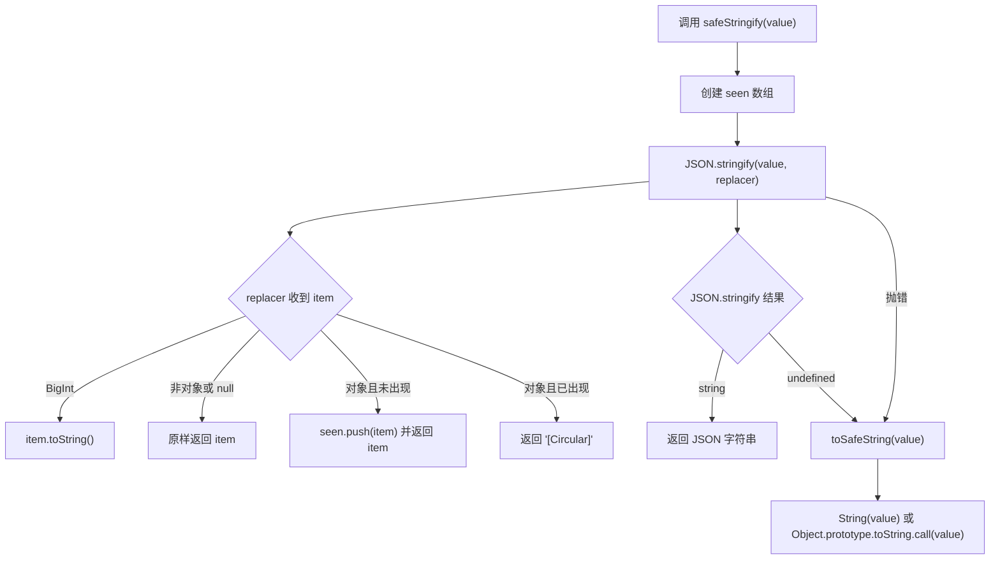

import primitiveDemo from './primitiveDemo?raw'
import circularDemo from './circularDemo?raw'
import { CodeOrSourceMdx } from '@storybook/addon-docs/blocks'

# safeStringify

安全序列化未知值，适合处理错误原因、日志上下文、上报 payload 等可能包含循环引用或 BigInt 的数据。

## 开发者视角

`safeStringify` 是对 `JSON.stringify` 的轻量保护层。它解决的是“监控和日志代码不能因为序列化未知值而中断业务流程”的问题，而不是追求完整还原对象图。

它的输入是 `unknown`，输出永远是 `string`。这意味着调用方不需要在外层写 `try/catch`，也不需要提前判断值是不是对象、是不是循环引用、是不是包含 `BigInt`。

这个工具目前被 `estimateBytes` 和 `earlyErrorQueue` 复用：

- `estimateBytes` 用它把非字符串输入转成可计算体积的稳定字符串
- `earlyErrorQueue` 用它处理未知 `PromiseRejectionEvent.reason`

## 模块边界

<table>
  <thead>
    <tr>
      <th>模块</th>
      <th>输入</th>
      <th>输出</th>
      <th>职责边界</th>
    </tr>
  </thead>
  <tbody>
    <tr>
      <td>
        <code>safeStringify</code>
      </td>
      <td>
        <code>unknown</code>
      </td>
      <td>
        <code>string</code>
      </td>
      <td>把任意值转成字符串，并保证转换过程不把异常抛给调用方。</td>
    </tr>
    <tr>
      <td>
        <code>estimateBytes</code>
      </td>
      <td>
        <code>unknown</code>
      </td>
      <td>
        <code>number</code>
      </td>
      <td>
        只关心序列化后的字节数；非字符串值的安全序列化交给
        <code>safeStringify</code>。
      </td>
    </tr>
    <tr>
      <td>
        <code>earlyErrorQueue</code>
      </td>
      <td>错误事件、未知错误原因</td>
      <td>标准化错误事件</td>
      <td>
        只负责错误语义的标准化；未知对象转字符串交给
        <code>safeStringify</code>。
      </td>
    </tr>
  </tbody>
</table>

## 数据结构

<table>
  <thead>
    <tr>
      <th>数据结构</th>
      <th>位置</th>
      <th>作用</th>
      <th>为什么这样设计</th>
    </tr>
  </thead>
  <tbody>
    <tr>
      <td>
        <code>seen: unknown[]</code>
      </td>
      <td>
        <code>safeStringify</code> 函数内部
      </td>
      <td>保存当前序列化过程中已经访问过的对象引用。</td>
      <td>
        只在单次调用内有效，不污染模块级状态；数组足够小，且避免引入
        <code>WeakSet</code> 对老环境兼容性和构建输出的影响。
      </td>
    </tr>
    <tr>
      <td>
        <code>JSON.stringify replacer</code>
      </td>
      <td>
        <code>JSON.stringify(value, replacer)</code>
      </td>
      <td>在 JSON 遍历每个属性时插入自定义处理逻辑。</td>
      <td>利用原生 JSON 遍历对象树，不手写递归，减少边界错误。</td>
    </tr>
    <tr>
      <td>
        <code>"[Circular]"</code>
      </td>
      <td>重复引用替换值</td>
      <td>标记对象图中再次出现的同一个对象。</td>
      <td>
        保留“这里原本是重复引用”的信息，同时让结果仍然是合法 JSON 字符串。
      </td>
    </tr>
  </tbody>
</table>

## 数据流

## 关键行为

<table>
  <thead>
    <tr>
      <th>输入</th>
      <th>处理方式</th>
      <th>原因</th>
    </tr>
  </thead>
  <tbody>
    <tr>
      <td>普通对象</td>
      <td>
        交给 <code>JSON.stringify</code>。
      </td>
      <td>保留 JSON 语义，输出适合日志和网络传输。</td>
    </tr>
    <tr>
      <td>循环引用对象</td>
      <td>
        重复对象替换为 <code>[Circular]</code>。
      </td>
      <td>避免 JSON 原生循环引用错误。</td>
    </tr>
    <tr>
      <td>
        <code>BigInt</code>
      </td>
      <td>转成十进制字符串。</td>
      <td>
        原生 <code>JSON.stringify</code> 遇到 BigInt
        会抛错，监控链路不应因此中断。
      </td>
    </tr>
    <tr>
      <td>
        <code>undefined</code>、函数、symbol 顶层值
      </td>
      <td>
        <code>JSON.stringify</code> 得到 <code>undefined</code> 后，降级为
        <code>String(value)</code>。
      </td>
      <td>保证函数返回值永远是字符串。</td>
    </tr>
    <tr>
      <td>自定义序列化抛错的对象</td>
      <td>
        捕获异常后调用 <code>toSafeString</code>。
      </td>
      <td>
        对象可能定义了有副作用或会抛错的 <code>toJSON</code>，需要兜底。
      </td>
    </tr>
  </tbody>
</table>

## 基础值序列化

基础值直接按 JSON 规则输出；`undefined` 这类 JSON 顶层不可序列化值会降级为字符串。

<CodeOrSourceMdx language="typescript">{primitiveDemo}</CodeOrSourceMdx>

## 循环引用序列化

对象图里重复出现的对象会输出为 `[Circular]`，避免抛出 `Converting circular structure to JSON`。

<CodeOrSourceMdx language="typescript">{circularDemo}</CodeOrSourceMdx>

## 参数介绍

<table>
  <thead>
    <tr>
      <th>参数名</th>
      <th>类型</th>
      <th>描述</th>
    </tr>
  </thead>
  <tbody>
    <tr>
      <td>value</td>
      <td>
        <code>unknown</code>
      </td>
      <td>需要安全序列化的任意值。</td>
    </tr>
  </tbody>
</table>

## 返回值

<table>
  <thead>
    <tr>
      <th>类型</th>
      <th>描述</th>
    </tr>
  </thead>
  <tbody>
    <tr>
      <td>
        <code>string</code>
      </td>
      <td>可安全展示、记录或继续计算体积的字符串。</td>
    </tr>
  </tbody>
</table>

## 函数级导读

<table>
  <thead>
    <tr>
      <th>函数</th>
      <th>职责</th>
      <th>说明</th>
    </tr>
  </thead>
  <tbody>
    <tr>
      <td>
        <code>toSafeString(value)</code>
      </td>
      <td>兜底字符串转换。</td>
      <td>
        优先调用 <code>String(value)</code>；如果对象自定义
        <code>toString</code> 仍然抛错，则使用
        <code>Object.prototype.toString.call(value)</code>。
      </td>
    </tr>
    <tr>
      <td>
        <code>safeStringify(value)</code>
      </td>
      <td>安全序列化入口。</td>
      <td>
        创建 <code>seen</code> 数组记录已访问对象，调用
        <code>JSON.stringify</code> replacer 处理循环引用和 BigInt；失败时走
        <code>toSafeString</code>。
      </td>
    </tr>
  </tbody>
</table>

## 逐行实现拆解

<table>
  <thead>
    <tr>
      <th>代码片段</th>
      <th>做了什么</th>
      <th>开发者关注点</th>
    </tr>
  </thead>
  <tbody>
    <tr>
      <td>
        <code>const seen: unknown[] = []</code>
      </td>
      <td>初始化单次调用内的访问记录。</td>
      <td>每次调用重新创建，避免不同调用之间互相污染。</td>
    </tr>
    <tr>
      <td>
        <code>JSON.stringify(value, replacer)</code>
      </td>
      <td>借助原生 JSON 遍历对象树。</td>
      <td>复杂对象的遍历顺序和属性处理仍遵循原生 JSON 规则。</td>
    </tr>
    <tr>
      <td>
        <code>typeof item === 'bigint'</code>
      </td>
      <td>提前处理 BigInt。</td>
      <td>BigInt 不能被 JSON 原生序列化，必须在 replacer 阶段转掉。</td>
    </tr>
    <tr>
      <td>
        <code>typeof item !== 'object' || item === null</code>
      </td>
      <td>快速放行基本类型和 null。</td>
      <td>只有对象引用才需要参与循环检测。</td>
    </tr>
    <tr>
      <td>
        <code>seen.includes(item)</code>
      </td>
      <td>判断对象引用是否已经出现过。</td>
      <td>这里比较的是引用身份，不是对象内容。</td>
    </tr>
    <tr>
      <td>
        <code>seen.push(item)</code>
      </td>
      <td>记录首次出现的对象。</td>
      <td>后续再次遇到同一引用时会替换为 `[Circular]`。</td>
    </tr>
    <tr>
      <td>
        <code>text ?? toSafeString(value)</code>
      </td>
      <td>处理 JSON 顶层不可序列化值。</td>
      <td>
        <code>JSON.stringify(undefined)</code> 返回 <code>undefined</code>
        ，但工具契约要求返回
        <code>string</code>。
      </td>
    </tr>
    <tr>
      <td>
        <code>catch &#123; return toSafeString(value) &#125;</code>
      </td>
      <td>捕获所有序列化异常。</td>
      <td>调用方不需要额外保护监控/日志代码。</td>
    </tr>
  </tbody>
</table>

## Storybook 文件说明

<table>
  <thead>
    <tr>
      <th>文件</th>
      <th>职责</th>
      <th>说明</th>
    </tr>
  </thead>
  <tbody>
    <tr>
      <td>
        <code>index.stories.ts</code>
      </td>
      <td>注册 Storybook story。</td>
      <td>
        设置标题 <code>element-utils/safeStringify</code>、绑定演示组件，并使用
        <code>centered</code> 布局。
      </td>
    </tr>
    <tr>
      <td>
        <code>index.tsx</code>
      </td>
      <td>渲染演示入口。</td>
      <td>只负责按钮 UI，具体业务演示拆到 demo 文件里。</td>
    </tr>
    <tr>
      <td>
        <code>primitiveDemo.ts</code>
      </td>
      <td>演示基础值序列化。</td>
      <td>覆盖 string、number、boolean、null、undefined 和 BigInt。</td>
    </tr>
    <tr>
      <td>
        <code>circularDemo.ts</code>
      </td>
      <td>演示循环引用序列化。</td>
      <td>构造 self 和 nested.parent 两种重复引用，观察 `[Circular]` 输出。</td>
    </tr>
    <tr>
      <td>
        <code>介绍.mdx</code>
      </td>
      <td>承载说明文档。</td>
      <td>解释适用场景、参数、返回值、函数职责和实现流程。</td>
    </tr>
  </tbody>
</table>

## 实现取舍

**为什么不直接 `JSON.stringify`**

直接调用在以下情况下会失败或返回非字符串：

- 循环引用对象会抛出异常
- `BigInt` 会抛出异常
- 顶层 `undefined`、函数、symbol 会返回 `undefined`
- 自定义 `toJSON` 可能抛出异常

**为什么用数组而不是 WeakSet**

当前工具目标是小型 payload、错误对象、日志上下文。数组实现更直观，构建输出更轻，也适配没有 `WeakSet` 的老环境。代价是重复检测是 O(n)，但在这些场景里对象规模通常很小。

**复杂度**

- 时间复杂度：约 O(n²)，其中 n 是对象节点数量；主要来自每个对象节点上的 `seen.includes`
- 空间复杂度：O(n)，用于保存访问过的对象引用

**限制**

- 它不会保留完整对象图关系，只用 `[Circular]` 标记重复引用
- 它不处理 `Map`、`Set` 的结构化展开，行为遵循原生 JSON 规则
- 它适合日志和监控，不适合做数据持久化格式
